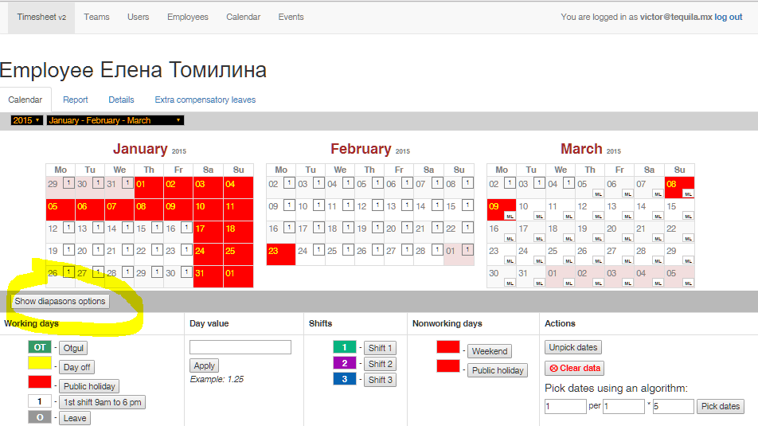

#User guide

##An objective

The application should help to collect an visualize information about working schedule of company

##Tasks

- Manage three levels of calendar: company's calendar, team's calendars and employee's calendar. 
    Combine the calendars to have a flexible settings of weekends and holidays for each team.
- Manage days' types on calendar (work, weekend, leave, business trip etc.)
- Manage shifts on calendar
- Manage values of working days
- Build a report
- Provide a view of timesheet for employees

##Roles

- Super admin (ROLE_SUPER_ADMIN) - creates teams, employees and users
- Admin (ROLE_ADMIN) - creates users and employees within the team
- Employee (ROLE_USER) - sees a readonly view of his team

##Authentication

To use the application the client has to enter his authentication details

If a client has not registered yet he can register if he will specify an email that equals 
the appropriate employee's email which already exists in the application.

If a client has forgotten a password there is a form for its reset

##User stories

### "My" page

- As an **EMPLOYEE** I can see a time schedule for my team for selected month
- As an **EMPLOYEE** I can change a year and a month of calendar
- As an **EMPLOYEE** I can see my row highlighted (not implemented)
- As an **EMPLOYEE** I can hide other employees (not implemented)
- As an **EMPLOYEE** I can see the report (not implemented)

### "Events" page

- As an **ADMIN** or **SUPERADMIN** I can see the list of events that are available in the application
- As an **SUPERADMIN** I can manage the list (not implemented)

### "Calendar" page

- As an **ADMIN** or **SUPERADMIN** I can see the company's calendar with data, and change the month and the year
- As an **SUPERADMIN** I can pick dates on the calendar and set it as weekend or public holiday
- As an **SUPERADMIN** I can pick dates using some useful algorithms (pick all fridays or pick every odd day etc.)

### "Users" page

- As an **ADMIN** or **SUPERADMIN** I can see a list of application's users
- As an **ADMIN** or **SUPERADMIN** I can filter the list by team
- As an **ADMIN** or **SUPERADMIN** I can move to the page with details of selected user
- As an **ADMIN** I can manage the users of my team
- As an **SUPERADMIN** I can manage any user

### "Teams" page

- As an **ADMIN** or **SUPERADMIN** I can see a list of application's teams
- As an **ADMIN** or **SUPERADMIN** I can move to the page with details of selected team
- As an **ADMIN** I can manage my team
- As an **SUPERADMIN** I can manage any team

On the "Team" page a term _manage_ means that user can:

- Change details of team (name, code and options flags)
- Set events on team's calendar
- Set events on employees' calendars (values, shifts and event types)

### "Employees" page

- As an **ADMIN** or **SUPERADMIN** I can see a list of application's employees
- As an **ADMIN** or **SUPERADMIN** I can filter the list by team
- As an **ADMIN** or **SUPERADMIN** I can move to the page with details of selected employee
- As an **ADMIN** or **SUPERADMIN** I can see the report for user that counts extra compensatory leaves
- As an **ADMIN** I can manage the employee of my team
- As an **SUPERADMIN** I can manage any employee

On the "Employee" page a term _manage_ means that user can:

- Change details of employee (name, surname etc.)
- Manage extra compensatory leaves
- Set events on employee's calendar (values, shifts and event types)

##Elements of layout

###Events and calendar's actions

Columns **Working days**, **Day value**, **Shifts**, **Non working days** have buttons that applies relevant event to 
picked dates of current employee's calendar

**Day value** is a float value of working days that will be counted for the day

**Shift** is a property that does not affect the counting of reports 

Column **Actions** contains buttons that allow:

- Unpick all picked dates
- Clear all events for picked dates
- Pick dates using an algorithm. From the picked date with the oldest date, algorithm will peek A days, make a gap  
    of B days then pick more A days and repeat it C times. It allows to pick all even days etc.
    
Also click onto day of week of the calendar should select all suitable days of month

###Calendar's day

A cell of the day divided on 4 areas:

- Title (left top)
- Value of a day (right top)
- Shift (left bottom)
- Event type (right bottom)

###Diapasons

To set a long events like a maternity leave the diapasons can be used

###Extra compensatory leaves

User can specify that for some reason an employee obtains an extra compensatory leave. It will counted in the report

###The report

The report calculates a quantity of each type of events and adds extra compensatory leaves. It does calculations for 
specified diapasons of dates

The report is available on the page of any employee, on the tab "Report"

###Calendars

There are 2 types of calendars:

- Horizontal - used on the page of team's employees. Shows only one month and several swimlanes of days for each employee
- "Month wrapped" - used on the pages of employee's calendar, team's calendar and company's calendar. It shows 3 month
    and allows actions depending of page and user's role
    
There are 3 levels of calendars:

- Company's calendar. It can be found as a **Calendar** link in main menu. Any team can apply it to its timesheet 
    or not depending of options Team/Details/**Is general calendar enabled**. 
    Here only weekends and public holidays can be set.
- Team's calendar. It can be found at Team/Calendar. Here only weekends and public holidays can be set.
    On the page there is no capability to change events of other calendars. If team uses the general calendar then
    the events of general calendar will be visible too, but not editable
- Employee's calendar. It can be found at Team/Employees and Employee/Calendar and on the My page. Here you can see
    a combined version of all three calendars (depending on "is general calendar enabled"). The user can edit only 
    events that belong to the employee's calendar (not a team's of company's). Here it's possible to set all kinds of
    events.
    
